<div align="center">

# 🚗 AbhiNOW  
### *Saath chalein? Abhi?*

A **full-stack ride-sharing & carpooling platform** built for **Hyderabad's daily commuters and students**.


> **AbhiNOW is a community-driven ride-sharing platform designed for recurring daily travel rather than one-time rides.**

[✨ Features](#-features) • [🛠️ Tech Stack](#️-tech-stack) • [📸 Screenshots](#-screenshots) • [🚀 Setup](#-getting-started)

</div>

---

# 💡 What is AbhiNOW?

AbhiNOW is a **ride-sharing & carpooling platform** built specifically for **Hyderabad's daily commuters and students**.

Unlike Uber or Rapido which focus on **one-time rides**, AbhiNOW is designed around **daily recurring travel routes**.

### Example Route

```text
Miyapur → Ameerpet → Hitech City
````

Passengers traveling on the same route can join the ride daily.

### Why AbhiNOW?

✅ Affordable daily travel
✅ Trusted recurring commuters
✅ Reduced traffic congestion
✅ Better ride-sharing experience

---

# ✨ Features

## 🎒 Passenger Features

* 🔍 Search rides by pickup & destination
* 📍 Live ride tracking
* ⭐ Driver ratings & reviews
* 🧾 Ride history & invoices
* 🚗 View driver details before booking
* 📱 OTP verification during registration

---

## 🚗 Driver Features

* 🗺️ Post rides with source & destination
* 📨 Accept / reject ride requests
* 📍 Share live location
* 💰 View earnings
* 🚘 Manage completed rides

---

## ⚙️ Admin Features

* 👥 User management
* 🚫 Suspend / Unsuspend users
* 🚗 Monitor rides
* ⭐ Moderate ratings
* 📍 Manage locations
* 📊 Dashboard analytics

---

## 🔐 Authentication & Security

* 🔑 JWT Authentication
* 🌐 Google OAuth Login
* 📱 Twilio OTP Verification
* 🔒 BCrypt Password Encryption
* 🛡️ Role-Based Authorization

---

## 🗺️ Real-Time Features

* 🗺️ Google Maps Integration
* 📍 Live Driver Tracking
* ⚡ WebSocket Communication
* 🛰️ Satellite View
* 📌 Route Visualization

---

# 🛠️ Tech Stack

## Backend

* Java 21
* Spring Boot
* Spring Security
* JWT Authentication
* Spring Data JPA
* Hibernate
* MySQL
* WebSockets
* Twilio API
* Google OAuth2
* Docker

## Frontend

* React.js
* React Router
* Axios
* Google Maps API
* STOMP + SockJS
* JWT Decode

---

# 🏗️ Architecture

```text
React Frontend
       ↓ REST API + JWT
Spring Boot Backend
       ↓ JPA / Hibernate
MySQL Database
```

### Real-Time Flow

```text
Driver App
     ↓
 WebSocket
     ↓
 Spring Broker
     ↓
 Passenger Live Tracking
```

---

# 📸 Screenshots

## 🏠 Home Page

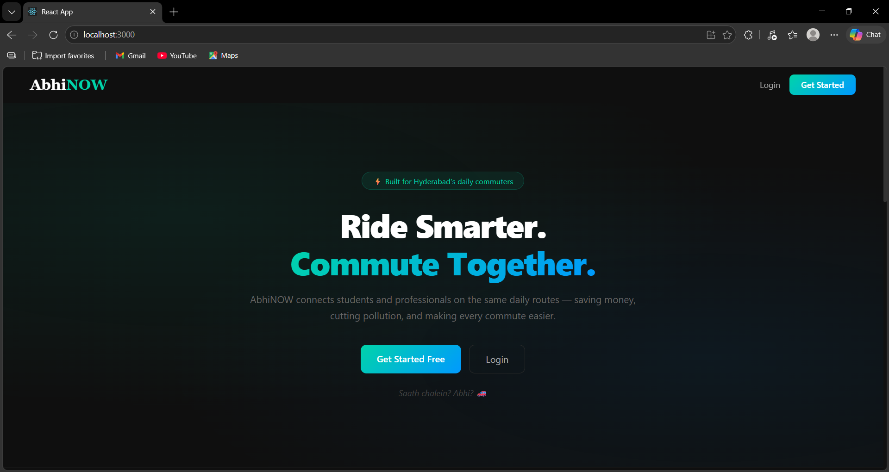

---

## 🔐 Login Page

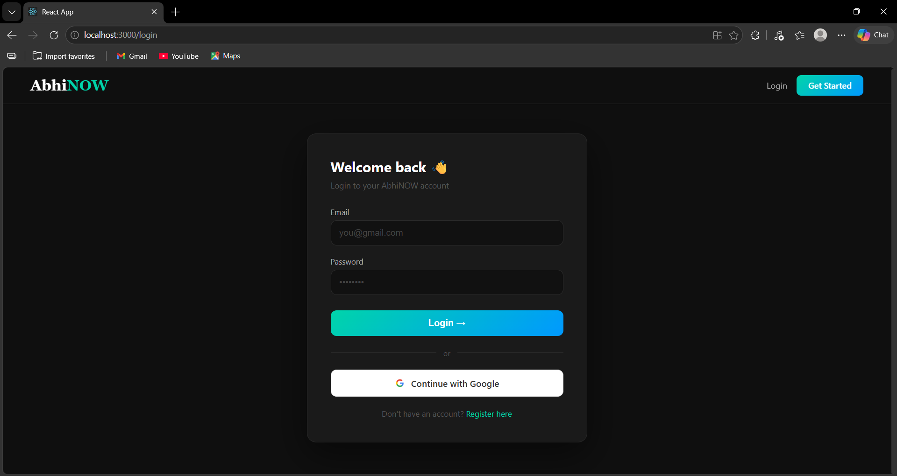

---

## 📝 Register Page

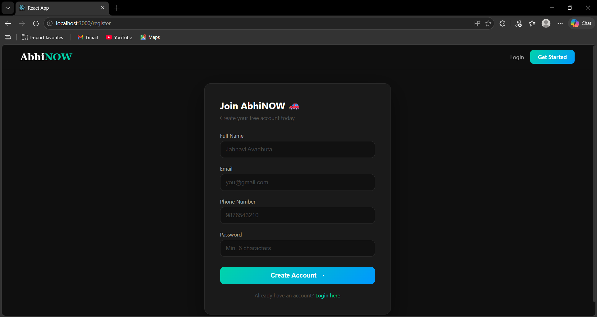

---

## 📱 OTP Verification

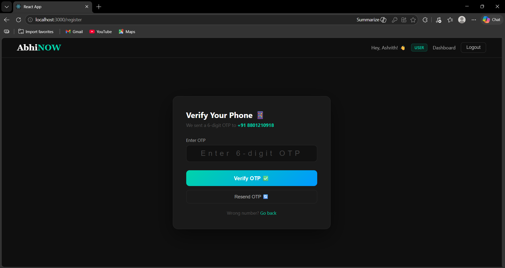

---

## 📊 Dashboard

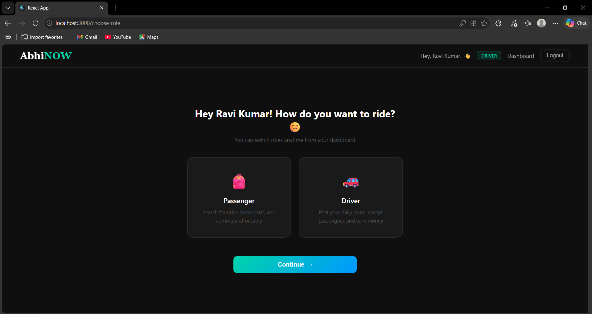

---

## 🚗 Post Ride

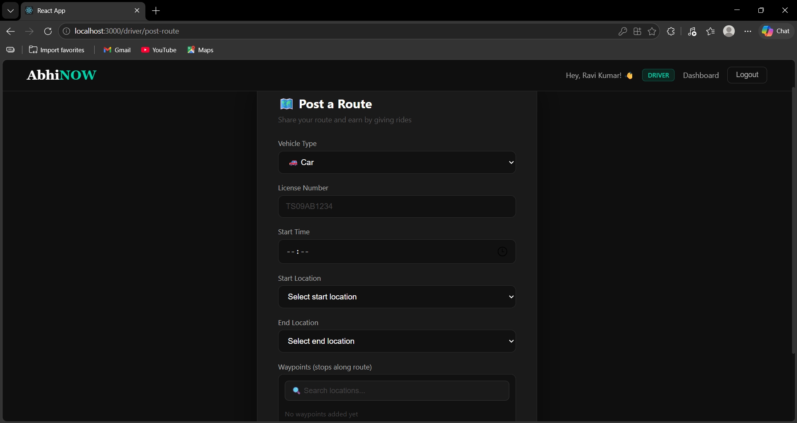

---

## 🔍 Search Ride

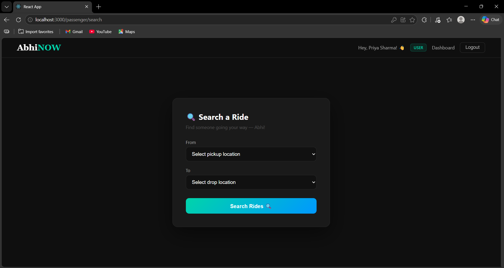

---

## 🚘 Passenger Dashboard

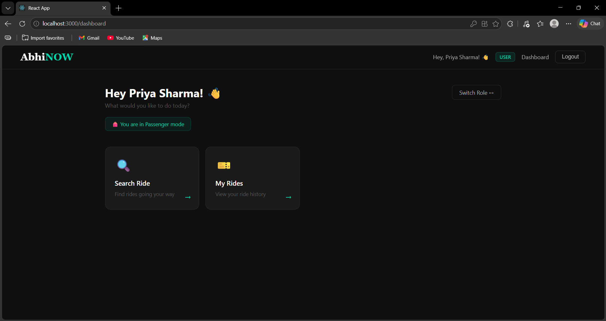

---

## 📍 Live Tracking

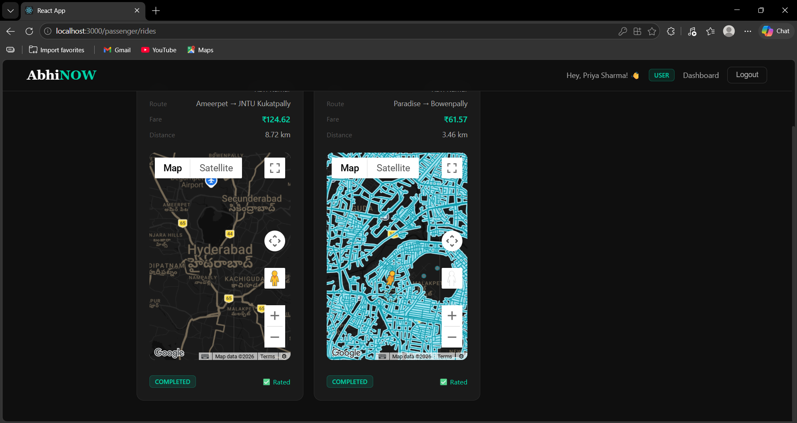

---

## 🛰️ Satellite View

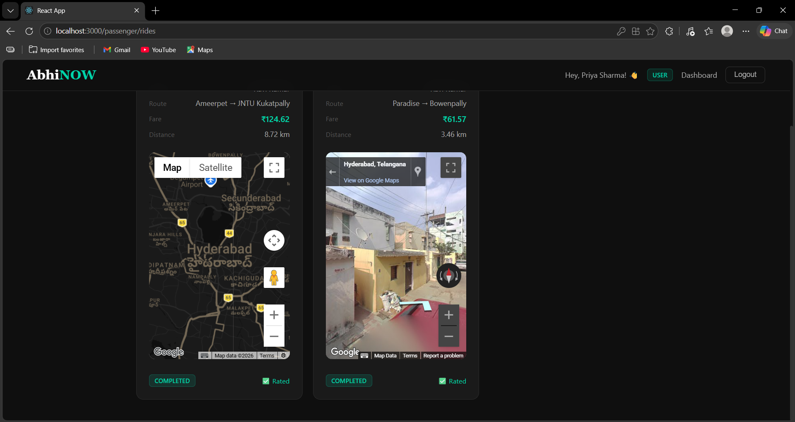

---

## 🚕 Driver Rides

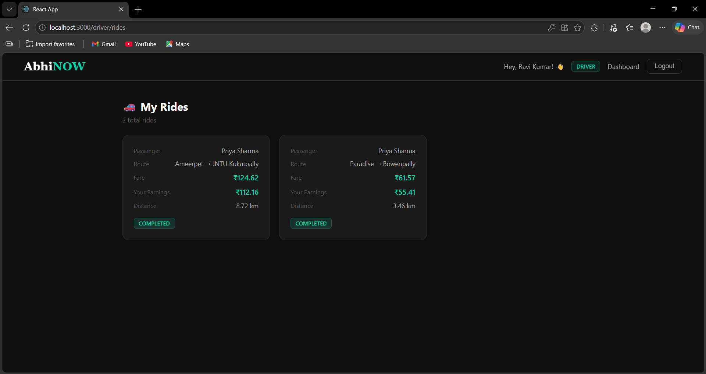

---

## 📨 Ride Requests

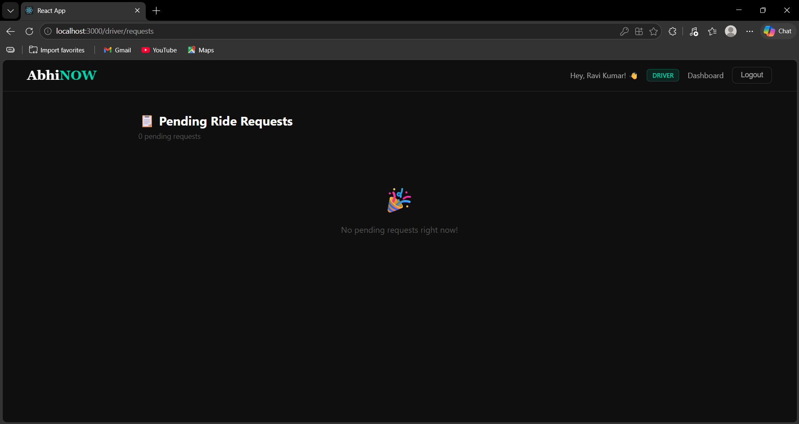

---

## ⚙️ Admin Dashboard

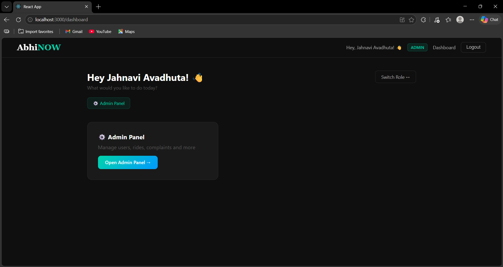

---

## 👥 Admin User Management

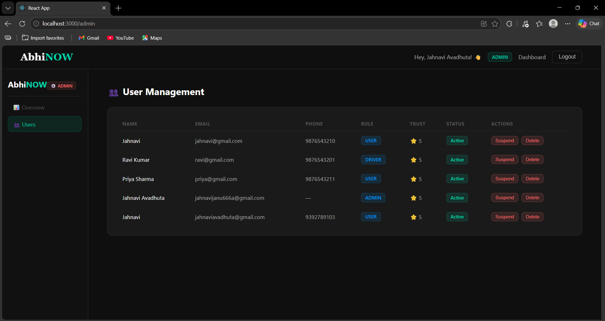

---

## 🛠️ Admin Panel

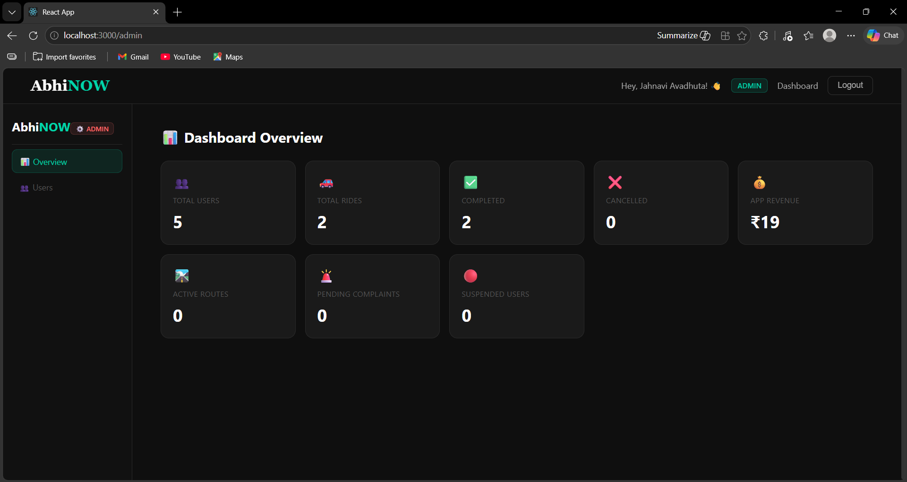

---

# 🚀 Getting Started

## Prerequisites

Install:

* Java 21+
* Node.js
* MySQL 8+
* Maven
* Docker (optional)

---

## 1. Clone Repository

```bash
git clone https://github.com/Jahnavi-Avadhuta/AbhiNOW-SpringBoot.git
cd AbhiNOW-SpringBoot
```

---

## 2. Create Database

```sql
CREATE DATABASE abhinow_spring;
```

---

## 3. Configure Application

Update:

```text
src/main/resources/application.yaml
```

Add your credentials:

```yaml
spring:
  datasource:
    username: root
    password: root

jwt:
  secret: YOUR_SECRET

twilio:
  account-sid: YOUR_ACCOUNT_SID
  auth-token: YOUR_AUTH_TOKEN

google:
  client-id: YOUR_CLIENT_ID
  client-secret: YOUR_CLIENT_SECRET
```

---

## 4. Run Backend

```bash
mvn spring-boot:run
```

Backend:

```text
http://localhost:8080
```

---

## 5. Run Frontend

```bash
cd abhinow-frontend
npm install
npm start
```

Frontend:

```text
http://localhost:3000
```

---

# 📡 Important APIs

| Method | Endpoint                       |
| ------ | ------------------------------ |
| POST   | `/api/auth/register`           |
| POST   | `/api/auth/login`              |
| POST   | `/api/otp/send`                |
| POST   | `/api/otp/verify`              |
| GET    | `/oauth2/authorization/google` |

---

# 🌟 Future Improvements

* [ ] Women-only rides
* [ ] Payment Gateway Integration
* [ ] Subscription Plans
* [ ] Smart Route Matching
* [ ] Mobile App
* [ ] Cloud Deployment

---

# 👩‍💻 Developer

**Jahnavi Avadhuta**

Built with ❤️ using **Spring Boot + React**

---

<div align="center">

### ⭐ Star this repository if you like the project ⭐

</div>
